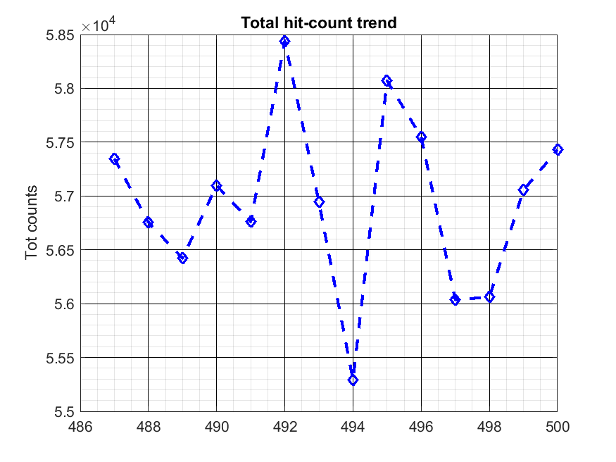

# tdc_autoconverter
***Bryce M. Henson, [Dong K. Shin](https://github.com/spicydonkey)***  
A matlab function that detetects new Delay Line Detector (DLD) files in a directory and processes them into a position time format that is saved.  

By front loading this fairly time consuming processing, later data analysis is dramatically sped up.


=======


## Install
``` 
git clone --recurse-submodules -j8 https://github.com/brycehenson/tdc_autoconverter.git
```
then to update 
```
git submodule update --remote --merge


## Features
- multiple checks that the data is done writing as there is no inbuilt end of data in the file
  -  the file modification time is in the past
  -  the last character is a newline
- checks if the DLD data file is newer than the processed file so that it can work even when the data files are being overridden. This occurs in the free run configuration where the data file is continually overridden. 
- for historical reasons the processed data is stored in the format [data name]_txy_forc[shot number].txt  eg. d_txy_forc1.txt
- checks if the first line of the data file is in the right format as another check
- gracefully handles a file being deleted
- gracefully handles a premature conversion


## Usage
In Matlab, call ````AutoConvert(DIR/TO/MONITOR,minFileSize,numMovAvg)````.
=======
- makes a plot of the atom number trend over shots and saves a corresponding image to ./out/monitor/number_history.png

## Usage
In Matlab, call ````tdc_auto_convert(DIR/TO/MONITOR,,min_file_size_mb,min_counts_hz,mov_mean_len)````.

If running on the TDC data acquisition machine, simply run the function without any arguments - it will use the default settings. 
 
## Improvements/Issues

    - [x] nice picture for github
    - [ ] improved function documentation and example usage
    - [x] TEST - OK. need to printout more details TODO
    - [x] Simple moving average of reconstructed hit counts would be beneficial to user 
    - [x] package into a function
    - [x] dynamic plotting of count trend (last few shots)
    - [ ] re-implment email alerts (in a way that does not expose an email password on git)
    - [ ] refresh stdout so that it's tidier and to be easy with -nodisplay environment
    - [ ] include https://github.com/brycehenson/Core_BEC_Analysis as submodule to reduce code redundancy
    - [ ] improved function documentation and example usage
	- [ ] fix the x axis of the plot to be time or shot number
	- [ ] integerate with find_data_files for cleaner code
	- [ ] verbose levels
    - [ ] re-implment email alerts (in a way that does not expose an email password on git)
    - [ ] refresh stdout so that it's tidier and to be easy with -nodisplay environment
	- [x] nice picture for github
	- [x] TEST - OK. need to printout more details TODO
    - [x] Simple moving average of reconstructed hit counts would be beneficial to user 
    - [x] package into a function
    - [x] dynamic plotting of count trend (last few shots)
	- [x] output plot image to ./out/monitor/number_history.png
	- [x] sad sound if low atom number

    
## Contributions
This project would not have been possible without the open source tools that it is based on.
- ***Jan*** [FileTime](https://au.mathworks.com/matlabcentral/fileexchange/24671-filetime)
